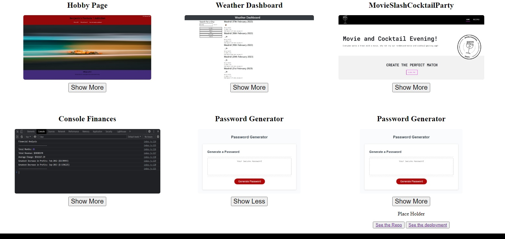

# Project-Gallery

To produce a basic project gallery using HTML and CSS.

## The Goal

When the page is loaded the page presents your name, a recent photo or avatar, and links to sections about you, your work, and how to contact you

When one of the links in the navigation is clicked then the UI scrolls to the corresponding section

When viewing the section about your work then the section contains titled images of your applications

When presented with the your first application then that application's image should be larger in size than the others

When images of the applications are clicked then the user is taken to that deployed application

When the page is resized or viewed on various screens and devices then the layout is responsive and adapts to my viewport

### Planning

Initially I looked into manipulating flexboxes to meet the responsiveness of the challenge, as the majority of the technical requirements are to do with how the boxes interact with display resolution. 

Once I was confident I knew how to do that, the rest was using my GitHub repo to import the data required to create a polished final product.

### Building & Debugging

I started by adding a title, a placement nav bar, and placement text for the projects. 

I then tested the CSS Flexbox (credits to resources below) to ensure that it worked. Once I was happy that with the placement of the cards, I started adding data and images from my GitHub. I confirmed the responsiveness once the information was added. 

I added button elements for individual links to the repo and deployment of each project, I also considered adding the buttons using JavaScript, but it didn't seem worthwhile as there was no need for dynamically created elements.  

I added a Show More button to the bottom of each card, and used a JavaScript loop to hide all the information until the button is pressed. Once its pressed, the data shows in "block" format and button text changes to Show Less. The loop added this to all the projects. As it is dynamic, more projects can be added without the need for code amendments. 

I finally added an about and contact section and then styled the site.

## Usage

To view the project, please follow the links below:

https://bcott93.github.io/Project-Gallery/

()

## License

Please see the License in the Repo.

## Credits
https://github.com/Bcott93?tab=repositories
https://blog.logrocket.com/responsive-image-gallery-css-flexbox/
https://www.w3schools.com/css/css_dropdowns.asp
https://www.w3schools.com/css/tryit.asp?filename=trycss_image_gallery

